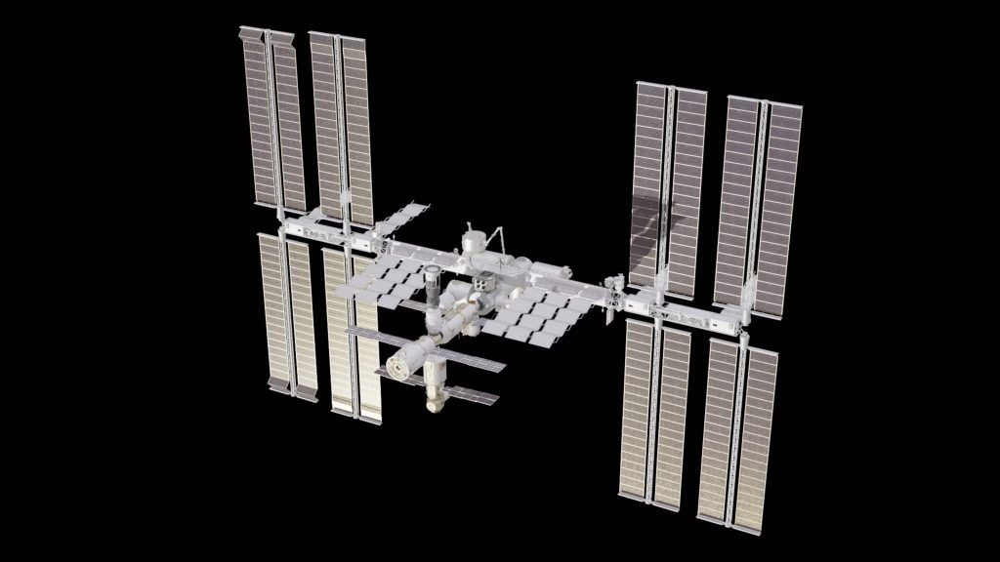
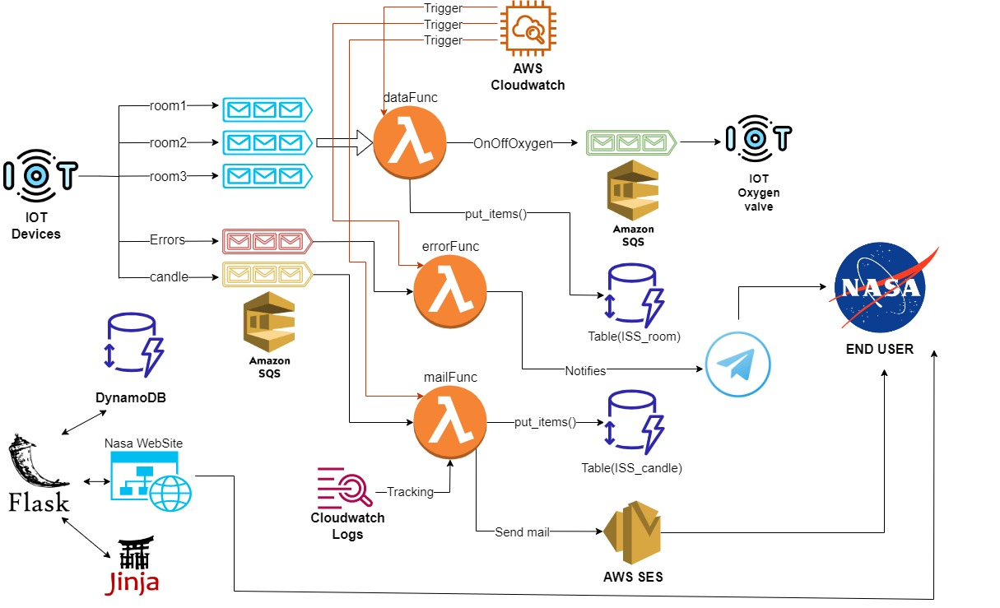

# Management of the The International Space Station atmosphere using Serverless Computing
<p align="center"></p>

## Overview

The International Space Station (often abbreviated to ISS - International Space Station) is, as the name suggests, a space station that is in low earth orbit. Its realization began in 1998 thanks to the collaboration between the USA (NASA), Russia (Roscosmos), Europe (ESA), Japan (JAXA) and Canada (CSA-ASC) and, within it, a lot of research is carried out in different fields - such as botany, medicine and materials sciences. The structure is made up of 17 modules assembled together at an altitude of about 400 km from the earth's surface and with a speed of about 28 thousand km/h. But what is the use of automated atmosphere management? Why are they doing experiments on board? Couldn't they do it here on Earth?

How is the Space Station made?

The Space Station is made up of many modules connected to each other, as if it were built with hyper-technological Legos. Among the various modules, one of the most important is the Zvezda, inside which there are the vital supports of the astronauts. Obviously it is not the only module to contain them: on the Station there are several of these systems, precisely to prevent the malfunction of one from endangering the lives of astronauts.
In this same module there are also two crew beds, a space toilet and the kitchen.

The module dedicated to the canteen is Unity and, next to this, there is Zarja, the first module ever launched and used today as a hold. As for the training of astronauts, the gyms have been installed inside the Tranquility module. Here there are a treadmill, an exercise bike and a special tool that allows you to simulate weight lifting. Living in a microgravity environment, physical activity is essential for astronauts to avoid loss of bone density and muscle tone.

There are usually 7 astronauts aboard the spaceship, although in some peak moments it is possible to even reach 11 for a few days. As for energy, the space station is powered by huge solar panels installed on 8 arms outside the structure.

## The project idea
Why is research being done on the Space Station? Wouldn't it be easier and cheaper to do it on Earth? Actually no: doing research in Space allows you to conduct experiments in conditions of microgravity, allowing you to do studies that, here on Earth, would be impossible.
The main laboratories are located in the Russian Nauka module, in the US Destiny module, in the European Columbus module and in Kibo, the double Japanese laboratory module which is also the largest in the entire Space Station!

The project consists in monitoring the atmosphere through the ventilation system of the ISS and through the use of IoT sensors.
The idea is to use sensors for temperature, humidity, gas recognition, Gas Shutoff and Gas Valve (simulated) in order to obtain information on the atmospheric conditions of the space station.
Previously gathered information informs astronauts about the amount of oxygen per cubic meter and warns them of the potential damage it could cause.

The purpose of this infrastructure is to obtain statistical analyzes of the space station's atmosphere in order to store them, process them and provide support to astronauts in case of need (such as alerting space entities such as NASA of the need for a new supply of supplies such as: oxygen candles).
The cloud is used to promote less energy waste on the International Space Station, reduce local computing costs (just think that to bring something to the station can cost $ 10,000 to $ 100,000 per kg range, imagine changing equipment very frequently, it would be an unsustainable cost, but thanks to the Cloud we are able to overcome these issues) and the ubiquitous access by NASA for more detailed analysis on Earth.

The project is based on an IoT Cloud architecture where several IoT sensors collect the data and send them on Cloud where they are processed through Serverless Computing and stored in a NoSQL database to be easily accessible.

## Implamentation overview
For simplification rather than using the names of all the modules, the IoT sensors are placed in 3 large modules called "rooms", they measure the temperature, humidity and the main gases present in the air such as nitrogen (N2), oxygen (O2), argon (Ar) and carbon dioxide (CO2). Every minute, each sensor sends a message with these values ​​on its queue. The dataFunc function is activated every 10 minutes by AWS Cloudwatch to retrieve information from the queues, at the end it saves the data in the DynamoDB database, and determines if the production of oxygen is higher than the norm, if this closes the ventilation valves to prevent too much oxygen being supplied.
Then there is the errorFunc which has the purpose of taking data from the error queue, in case some iot device gets damaged and informs via Telegram which device has had a malfunction and at what time.
Finally, there is the mailFunc which checks the status of the oxygen candles in the ISS and determines if the number of candles on board is sufficient to ensure a correct supply of oxygen to the space station. In case mailFunc notices that the candle supply is about to run out, it informs NASA's oxygen candle suppliers via the AWS SES service in order to arrange a replenishment shipment.

Finally we have the website where it is possible to see in real time thanks to ajax the situation of the entire space station, and it is possible to check in detail every single room and obtain the logs generated by the devices.

## Architecture
<p align="center"></p>

-   IoT devices: Simulated using a Python script, with boto3. They measure every second the temperature, humidity and the main gases present in the air such as nitrogen (N2), oxygen (O2), argon (Ar) and carbon dioxide (CO2).
-   AWS SQS: Used to store the messages of IoT sensors, then, these informations are retrieved by the serverless function.
-   AWS Lambda: Offers the environment where the serverless function is deployed.
-   AWS CloudWatch: Implements the rule, through EventBridge, which invoke the serverless function every 10 minutes.
-   AWS DynamoDB: Utilized to store data, in particular, the atmosfere status, humidity, temperature and the candle status.
-   Flask: Web server which allows the use of python as backend programming language.
- Jinja : is a web template engine for the Python programming language.
-   AWS SES: Used to send the mail to the oxygen candle provider.
-   Cloudwatch logs: Tracks the e-mails sent.
- Telegrams:  send a message of which device has had a malfunction and at what time.

# Installation and usage

### Prerequisities

1. Docker
2. AWS CLI
3. boto3
4. Flask
5. (Optional) nodejs for database interface
6. (Optional) telegram bot
7. (Optional) PyCharm

#### **Prerequisites fast guide:**
- Docker: https://docs.docker.com/engine/install/ubuntu/
    remember to create enable the use of Docker without root
    https://docs.docker.com/engine/install/linux-postinstall/
- Python3 https://docs.python-guide.org/starting/install3/linux/
- pip `sudo apt install python3-pip`
- Boto3 `pip install boto3`

Install and configure the AWS CLI:
- Installation: https://docs.aws.amazon.com/cli/latest/userguide/getting-started-install.html
- Configuration: https://docs.aws.amazon.com/cli/latest/userguide/cli-configure-quickstart.html
	
-	commands to run:
	``` sudo apt install npm
	sudo apt update
	pip install flask
	pip install flask-login
	pip install flask-sqlalchemy
	```
# Setting up the environment
1. Clone the repository:
	```
	git clone https://github.com/Antonio-Zizzari/International-Space-Station-IOT.git
	```
2. Launch LocalStack:
	```
	docker run --rm -it -p 4566:4566 -p 4571:4571 localstack/localstack
	```

	- test the docker container:
		```
		aws s3 mb s3://test --endpoint-url=http://localhost:4566
		```

3. Run DynamoDB and create tables of DynamoDB:
	```
	DYNAMO_ENDPOINT=http://localhost:4566 dynamodb-admin
	```
	```
	python3 DynamoDB/createTable.py
	```
4. Create and check the SQS queue:
	```
	aws sqs create-queue --queue-name room1 --endpoint-url=http://localhost:4566
	aws sqs create-queue --queue-name room2 --endpoint-url=http://localhost:4566
	aws sqs create-queue --queue-name room3 --endpoint-url=http://localhost:4566
	aws sqs create-queue --queue-name candle --endpoint-url=http://localhost:4566
	aws sqs create-queue --queue-name Errors --endpoint-url=http://localhost:4566
	aws sqs create-queue --queue-name OnOffOxygen --endpoint-url=http://localhost:4566
	```
	- Print all the SQS queue:
	```
	aws sqs list-queues --endpoint-url=http://localhost:4566
	```

5. Verify email identity:
	```
	aws ses verify-email-identity --email-address nasa@nasa.com --endpoint-url=http://localhost:4566
	```

###   Create the time-triggered Lambda functions to elaborate the data

1. Create the role:
	```
	aws iam create-role --role-name lambdarole --assume-role-policy-document file://ServerlessFunction/role_policy.json --query 'Role.Arn' --endpoint-url=http://localhost:4566
	```

2.  Attach the policy:
	```
	aws iam put-role-policy --role-name lambdarole --policy-name lambdapolicy --policy-document file://ServerlessFunction/policy.json --endpoint-url=http://localhost:4566
	```

3.  Create the zip file, move in the folder 'code'(Make sure that config.py is configurated)
	```
	cd ServerlessFunction
	zip -j data.zip dataFunc.py ../config.py ../globalData.py
	zip -j error.zip errorFunc.py ../config.py ../globalData.py
	zip -j mail.zip mailFunc.py ../config.py ../globalData.py
	```
4.  Create the function and save the Arn (it should be something like arn:aws:lambda:us-east-2:000000000000:function:smartIrrigation):

	```
	aws lambda create-function --function-name data --zip-file fileb://data.zip --handler dataFunc.lambda_handler --runtime python3.8 --role arn:aws:iam::000000000000:role/lambdarole --endpoint-url=http://localhost:4566
	```
	```
	aws lambda create-function --function-name error --zip-file fileb://error.zip --handler errorFunc.lambda_handler --runtime python3.8 --role arn:aws:iam::000000000000:role/lambdarole --endpoint-url=http://localhost:4566
	```
	```
	aws lambda create-function --function-name mail --zip-file fileb://mail.zip --handler mailFunc.lambda_handler --runtime python3.8 --role arn:aws:iam::000000000000:role/lambdarole --endpoint-url=http://localhost:4566
	```
	- If you want invoke the lambda function manually, at the first generate the random values of sensors and then invoke the serverless function:
		```
		python3 IoTDevices/runIoTDevices.py
		```
		```
		aws lambda invoke --function-name data out --endpoint-url=http://localhost:4566
		```
		```
		aws lambda invoke --function-name error out --endpoint-url=http://localhost:4566
		```
		```
		aws lambda invoke --function-name mail out --endpoint-url=http://localhost:4566
		```

5.  Set up a CloudWatch rule to trigger the lambda functions, create the rule and save the Arn (it should be something like arn:aws:events:us-east-2:000000000000:rule/<--name>):

	```
	aws events put-rule --name everyMin --schedule-expression "rate(10 minutes)" --endpoint-url=http://localhost:4566
	```
	-  Check that the rules has been correctly created with the frequency wanted:
		```
		aws events list-rules --endpoint-url=http://localhost:4566
		```
	-  Add permissions to the rule:

		```
		aws lambda add-permission --function-name data --statement-id everyMin --action 'lambda:InvokeFunction' --principal events.amazonaws.com --source-arn arn:aws:events:us-east-2:000000000000:rule/data --endpoint-url=http://localhost:4566
		```
		```
		aws lambda add-permission --function-name error --statement-id everyMin --action 'lambda:InvokeFunction' --principal events.amazonaws.com --source-arn arn:aws:events:us-east-2:000000000000:rule/error --endpoint-url=http://localhost:4566
		```
		```
		aws lambda add-permission --function-name mail --statement-id everyMin --action 'lambda:InvokeFunction' --principal events.amazonaws.com --source-arn arn:aws:events:us-east-2:000000000000:rule/mail --endpoint-url=http://localhost:4566
		```
	-  Add the lambda functions to the rule using the JSON file containing the Lambda function Arn:
		```
		aws events put-targets --rule everyMin --targets file://data_targets.json --endpoint-url=http://localhost:4566
		```
		```
		aws events put-targets --rule everyMin --targets file://error_targets.json --endpoint-url=http://localhost:4566
		```
		```
		aws events put-targets --rule everyMin --targets file://mail_targets.json --endpoint-url=http://localhost:4566
		```
### Telegram bot settings:
1.  Create a new bot requiring it from BotFather through telegram.
2.  Obtain your bot_id from  [https://api.telegram.org/bot](https://api.telegram.org/bot)<YOUR_TOKEN>/getUpdates.
3.  Open config.py and edit the fields: TELEGRAM_SWITCH = "true", TOKEN_TELEGRAM_BOT= <YOUR_TOKEN>, ID_PRODUCER= <YOUR_ID>.

### Last settings:
- Edit the values into the config.py (The port of the service, the cookie key for the website, endpoint url of localstack, emails, id of the telegram account, token telegram, if you want mail and telegram mode on) also you can edit globalData.py.

## How run
1.  Simulate the IoT devices:
	```
	python3 IoTDevices/runIoTDevices.py
	```
2. Load data into DynamoDB:
	```
	python3 DynamoDB/loadData.py
	```
3. Run Flask website:
	```
	python3 main.py
	```
4.  Go to the website and see the informations what you want.
5.   To check the logs about the sent emails, run this command:
		```
		aws logs get-log-events --log-group-name ISS_Candle --log-stream-name EmailSent --endpoint-url=http://localhost:4566
		```

